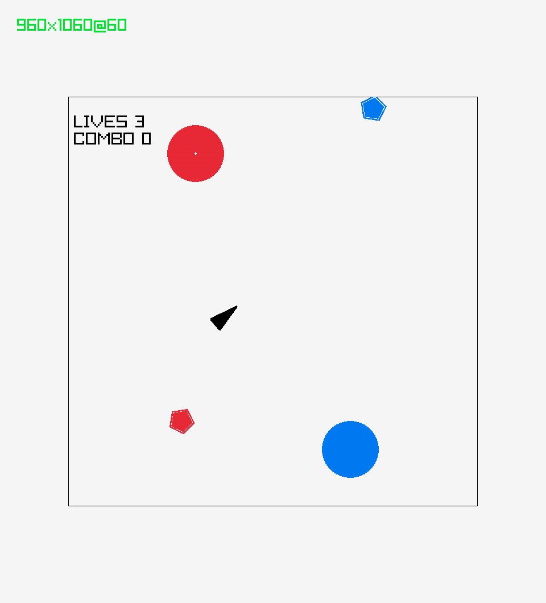
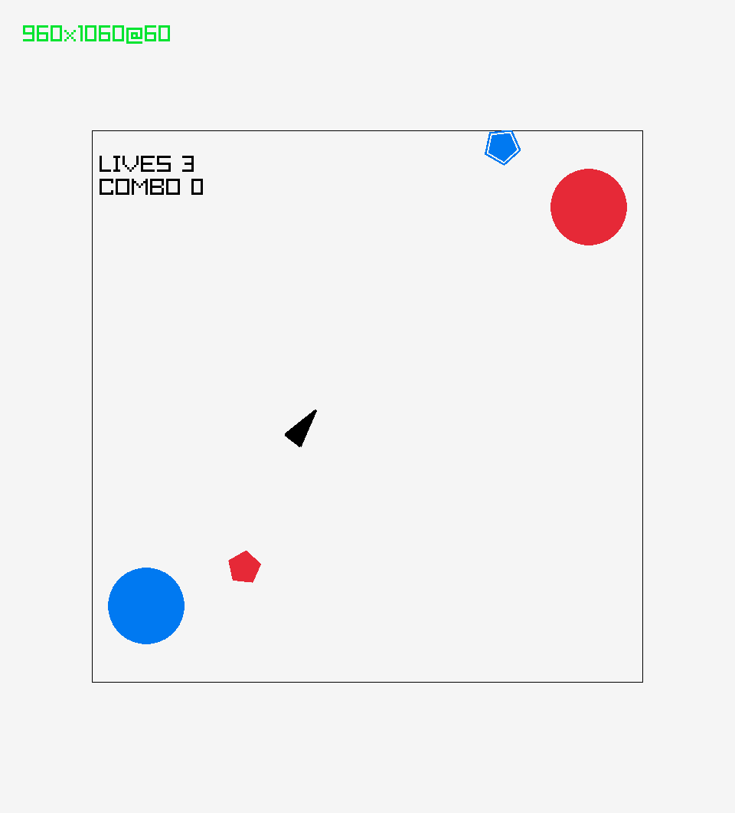

## Asteruga

[PLAY IT HERE](https://gabrielssanches.itch.io/asteruga)

### Description

Asteroid + Ikaruga combined

Destroid all asteroids in1 a level to clear it

Colored asteroids as resistent to bullets of different colors!
Change your ships color to destroy them more quickly

Meet goals to earn stars. Each level has a combo/time to beat.

### Controls

Keyboard:
 - [W] Throttle forward
 - [S] Throttle backwards 
 - [Q] Throttle left (strafe) 
 - [E] Throttle right (strafe) 
 - [A] Rotate CCW
 - [D] Rotate CW
 - [SPACE] Shoot/Select
 - [ESCAPE] Pause

### Screenshots

### Credits

 - Level 1 soundtrack - https://freesound.org/people/BloodPixelHero/sounds/636256/
 - Level 2 soundtrack - https://freesound.org/people/BloodPixelHero/sounds/678909/
 - Level 3 soundtrack - https://freesound.org/people/BloodPixelHero/sounds/609208/ 
 - Boss soundtrack - https://freesound.org/people/BloodPixelHero/sounds/707651/
 - Boss defeat - https://freesound.org/people/sonically_sound/sounds/624882/
 - Power up - https://freesound.org/people/JavierZumer/sounds/257225/

### Links

 - [gabrielssanches.itch.io/asteruga](https://gabrielssanches.itch.io/asteruga)

### License

This game sources are licensed under an unmodified zlib/libpng license, which is an OSI-certified, BSD-like license that allows static linking with closed source software. Check [LICENSE](LICENSE) for further details.

*Copyright (c) 2024 gabrielssanches*
